<!-- Animated Typing Header -->

<!-- Tagline -->

<em>Bridging Public Safety and Technology Innovation</em>

<!-- Quick Navigation -->

<a href="#about">About</a> •
<a href="#technology-stack">Tech Stack</a> •
<a href="#featured-projects">Projects</a> •
<a href="#github-analytics">Analytics</a> •
<a href="#connect">Connect</a>

<!-- Social Badges -->

---

## About

<table>
<tr>
<td width="60%">

With **13 years** of specialized experience in law enforcement (SWAT & K9 operations) and deep expertise in technology implementation, I architect and deliver enterprise-grade **Real-Time Crime Center (RTCC)** solutions for public and private sector organizations. My unique perspective combines operational field experience with technical program management, enabling me to build solutions that solve real-world challenges.

As a **Senior Technical Program Manager at Axon**, I lead the implementation and deployment of **Fusus RTCC platforms**: cloud-based ecosystems that aggregate live video, data, and sensor feeds from diverse sources to provide unified situational awareness for law enforcement and enterprise security.

**Core Focus Areas:**
- Orchestrating complex technical integrations across diverse systems
- Managing cross-functional teams for scalable solution delivery
- Collapsing response times through data-driven decision systems
- Hands-on AI/ML integration and Python development

</td>
<td width="40%" align="center">

</td>
</tr>
</table>

---

## Technology Stack

**Languages & Core**

**AI & Machine Learning**

**Frameworks & Libraries**

**Databases**

**Infrastructure & DevOps**

**Developer Tools**

---

## Credentials

**Bachelor of Science in Criminal Justice** | *Concentration: Forensics & Technology*

---

## Featured Projects

<table>
<tr>
<td width="50%">

### [NeurOllama AI](https://github.com/ericmaddox/neurollama-ai)

AI assistant with **contextual memory**, **sentiment analysis**, and **text-to-speech**. Maintains conversation history, adapts responses based on user emotional state, and features customizable voice output using Llama 3.2.

</td>
<td width="50%">

### [Crime Analyst AI](https://github.com/ericmaddox/crime-analyst-ai)

Enterprise **crime data analysis** platform with dark-themed web UI. Uses Ministral-3:3b for AI-powered predictions, interactive heatmaps, and risk-coded markers on Folium maps.

</td>
</tr>
<tr>
<td width="50%">

### [Mars Nexus Wrapper](https://github.com/ericmaddox/mars-nexus-wrapper)

Python wrapper for **NASA's Mars APIs** providing access to weather data, Curiosity/Perseverance rover images, and orbital information. Simplifies integration for space exploration applications.

</td>
<td width="50%">

### [HTML Dungeon Crawl](https://github.com/ericmaddox/html-dungeon-crawl)

**Procedurally generated** dungeon crawler using HTML5 Canvas. Features turn-based combat, randomized maze generation, fog of war, potion inventory, and dynamic difficulty scaling. Zero external dependencies.

</td>
</tr>
<tr>
<td width="50%">

### [VisualBase64](https://github.com/ericmaddox/visualbase64)

Lightweight **image-to-base64** converter with Tkinter GUI. Drag-and-drop interface for seamless encoding workflows. Ideal for embedding images in HTML, CSS, or JSON.

</td>
<td width="50%">

### [Orbital Void](https://github.com/ericmaddox/orbital-void)

Fast-paced **top-down space shooter** with wave-based combat, upgrade systems, and persistent progression. Features real-time physics, particle effects, and responsive controls. Pure vanilla JavaScript.

</td>
</tr>
<tr>
<td width="50%">

### [Markdown to AI Dataset](https://github.com/ericmaddox/markdown-to-ai-dataset)

Python utility converting **Markdown documentation into JSON datasets** for LLM fine-tuning. Formatted for HuggingFace Datasets library with structured prompt/completion pairs.

</td>
<td width="50%">

### [NPX Business Card](https://github.com/ericmaddox/npx-card)

Cyberpunk-themed **digital business card** executable via terminal. Features neon ASCII art, interactive menu, and direct links to socials.

</td>
</tr>
</table>

---

## GitHub Analytics

  

  <picture>
    <source media="(prefers-color-scheme: dark)" srcset="https://github.com/ericmaddox/ericmaddox/blob/output/github-snake-dark.svg" />
    <source media="(prefers-color-scheme: light)" srcset="https://github.com/ericmaddox/ericmaddox/blob/output/github-snake.svg" />
    
  </picture>

---

## Connect

Open to collaborations on <b>AI/ML projects</b>, <b>public safety tech</b>, and <b>innovative solutions</b>.

---

Powered by caffeine, curiosity, and continuous passion for innovation.

